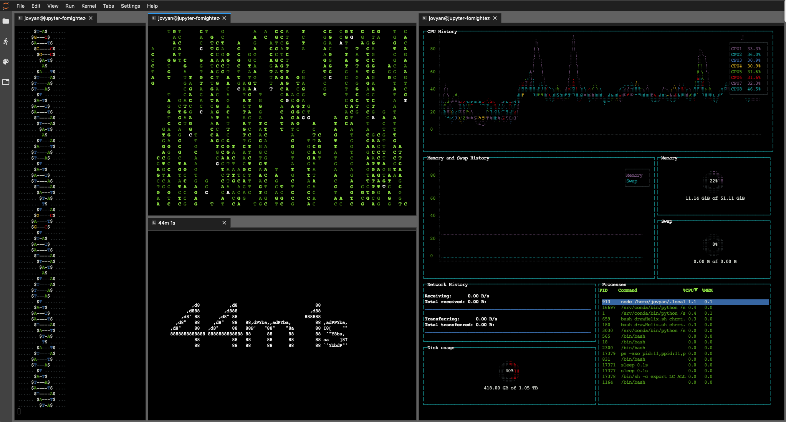

# b-roll-binder

[](https://mybinder.org/v2/gh/fomightez/b-roll-binder/master?urlpath=lab)

>'for the future when the camera crew wants B-roll and asks you to sit at your desk "doing bioinformatics"'  - *Mike Love in [this post](https://twitter.com/mikelove/status/1011270925868781568)*

Binderizes the featured software and some other techy-looking command line apps in order make a fancy-looking 'science-ing' background dashboard look using a Jupyter session or an Rstudio session served from MyBinder.org.



Flavors available:

- Jupyter
- Rstudio

-----

Additional inspiration also added from [Mara Averick](https://twitter.com/dataandme/status/1119027392838799361) and some other resources I deemed cool.

## Features
- [Artem Babaian's drawHelix.sh](https://github.com/bioSyntax/bioSyntax/blob/master/dev/scripts/drawHelix.sh)
- [Can Güney Aksakalli's gtop](https://github.com/aksakalli/gtop)
- [William Mannard's unimatrix](https://github.com/will8211/unimatrix)
- [Torsten Rehn's termdown](https://github.com/trehn/termdown)

## How To: Step-by-Step

For Jupyter, follow the steps in this section. RStudio is covered under 'Prefer RStudio' below.

Launch Binder session from the `launch binder` badge above or click [here]((https://mybinder.org/v2/gh/fomightez/b-roll-binder/master?urlpath=lab)) and then follow the steps below to fill the panels with the running tech like in the image above:

- When the session launches, the four terminal panels should already be arranged in your browser window much like in the image above. You'll probably want to stretch out the browser window to fill your screen as much as possible. <=== UPDATE: **Don't be surprised if the automatic arranging of the terminal panels does not happen. I had seen it stop working about a year ago as JupyterLab workspaces and Binder changed some things. However, today I noticed it was working again. Then after deleting an old note mentioning it wasn't working, upon rebuild it seemed to show the correct arrangement for split second and then it goes away. In short you may need to make and arrange the terminal windows yourself. Hopefully eventually things will stabilize so the window opens with the correct arrangement reliably again.**

- The remaining steps just step through placing code into each of the terminal panels to execute so that the appropriate program starts.

If it helps in getting the code into the right terminals, this `README` file can be opened in the running session. But how do you get to that file in the session? Because when the session opens the layout is set with the file browser hidden, you'll need to toggle open the file browser. To do this, click the File Browser icon that looks like a folder on the left upper side of the panels, or in the menu from under toggle on 'View' > 'Show LeftSidebar' to open the file navigation panel. The shortcut for this on Macs is command-B.  
Note: It is easiest to view and copy the code if you open the `READEME` in the running session by right-clicking on the file and choosing to `Open With` > `Markdown Preview`.  
You may wish to click on the name of the `README.md` file in its tab and drag it over to cover the panel on the far right because the one on the left that it opens into by default gets compressed the most when you open the file browser pane.  

- **In the panel on the far left, kick off the scrolling helix using the included FASTA sequence with the command below followed by hitting return.**

```shell
bash drawHelix.sh chrmt.fsa
```

- Want a sequence more to your liking to be scrolling by on your screen?  
OPTIONAL:  
Hit `q` to stop the included sequence from scrolling, upload a different DNA of you choosing (you can drag and drop into JupyterLab's file navigation panel)m and point the script at that. Such as the following, where `myDNA.fa` is replaced with the name of your sequence file:

```shell
bash drawHelix.sh myDNA.fa
```


- **If too much open space is displaying on the right side of the panel, move the right-hand border, found to the right of the scrolling DNA, over to the left.**


- **In the panel in the middle top, start the matrix-like rain, as if it is featuring DNA, by running the command below:**
 
```shell
unimatrix -s 96 -u 'ACTG'
```

You can click in the matrix-like rain panel and type `q` at any point to stop it.  
OPTIONAL:  
If you don't want the matrix-looking panel restricted to DNA bases, when starting or restarting it just type the following instead to start the matrix-like panel running:

```shell
unimatrix
```

- **In the panel in the middle bottom pane, start the countdown by executing the command below:**
 
```shell
termdown 59m
```

- **Finally, in the far-right pane, start `gtop` by typing the command below and hitting return:**
 
```shell
gtop
```

- **Enjoy.** If you followed all those steps, you should now have something like below. 


The panels are actually fully able to be moved and you can drag the borders to adjust to arrange the panels as you prefer.

Optional: open any interesting structure in PyMol or UCSF Chimera and place the window to either side of your browser.

Optional: You can also run [DustinKirkland's Hollywood](https://github.com/dustinkirkland/hollywood) by typing `hollywood`.

Optional for tmux pros: You could instead just launch one terminal window and use tmux to launch and arrange panes in which you can then run the software highlighted above.

TROUBLESHOOTING:  
Note: That if any of the middle, stacked panels seem to not be filling their area or the timer is really small, just use `q` to stop each one indivdually. And then use the up arrow to bring up the command last run and hit return to start running again. That usually fixes them.

(*Of course it would be nice if the terminals opened with the commands needed to be run in them already at the prompts; however, [due to security concerns](https://github.com/jupyterlab/jupyterlab/issues/6158#issuecomment-482331576) that isn't possible.*)

## Prefer RStudio?

RStudio is limited to one terminal window at a time(?).  
Use the following badge to launch RStudio and then you can choose what tech tool to run in the active terminal pane:

[![badge](https://img.shields.io/badge/launch-RStudio-579ACA.svg?logo=data:image/png;base64,iVBORw0KGgoAAAANSUhEUgAAAFkAAABZCAMAAABi1XidAAAB8lBMVEX///9XmsrmZYH1olJXmsr1olJXmsrmZYH1olJXmsr1olJXmsrmZYH1olL1olJXmsr1olJXmsrmZYH1olL1olJXmsrmZYH1olJXmsr1olL1olJXmsrmZYH1olL1olJXmsrmZYH1olL1olL0nFf1olJXmsrmZYH1olJXmsq8dZb1olJXmsrmZYH1olJXmspXmspXmsr1olL1olJXmsrmZYH1olJXmsr1olL1olJXmsrmZYH1olL1olLeaIVXmsrmZYH1olL1olL1olJXmsrmZYH1olLna31Xmsr1olJXmsr1olJXmsrmZYH1olLqoVr1olJXmsr1olJXmsrmZYH1olL1olKkfaPobXvviGabgadXmsqThKuofKHmZ4Dobnr1olJXmsr1olJXmspXmsr1olJXmsrfZ4TuhWn1olL1olJXmsqBi7X1olJXmspZmslbmMhbmsdemsVfl8ZgmsNim8Jpk8F0m7R4m7F5nLB6jbh7jbiDirOEibOGnKaMhq+PnaCVg6qWg6qegKaff6WhnpKofKGtnomxeZy3noG6dZi+n3vCcpPDcpPGn3bLb4/Mb47UbIrVa4rYoGjdaIbeaIXhoWHmZYHobXvpcHjqdHXreHLroVrsfG/uhGnuh2bwj2Hxk17yl1vzmljzm1j0nlX1olL3AJXWAAAAbXRSTlMAEBAQHx8gICAuLjAwMDw9PUBAQEpQUFBXV1hgYGBkcHBwcXl8gICAgoiIkJCQlJicnJ2goKCmqK+wsLC4usDAwMjP0NDQ1NbW3Nzg4ODi5+3v8PDw8/T09PX29vb39/f5+fr7+/z8/Pz9/v7+zczCxgAABC5JREFUeAHN1ul3k0UUBvCb1CTVpmpaitAGSLSpSuKCLWpbTKNJFGlcSMAFF63iUmRccNG6gLbuxkXU66JAUef/9LSpmXnyLr3T5AO/rzl5zj137p136BISy44fKJXuGN/d19PUfYeO67Znqtf2KH33Id1psXoFdW30sPZ1sMvs2D060AHqws4FHeJojLZqnw53cmfvg+XR8mC0OEjuxrXEkX5ydeVJLVIlV0e10PXk5k7dYeHu7Cj1j+49uKg7uLU61tGLw1lq27ugQYlclHC4bgv7VQ+TAyj5Zc/UjsPvs1sd5cWryWObtvWT2EPa4rtnWW3JkpjggEpbOsPr7F7EyNewtpBIslA7p43HCsnwooXTEc3UmPmCNn5lrqTJxy6nRmcavGZVt/3Da2pD5NHvsOHJCrdc1G2r3DITpU7yic7w/7Rxnjc0kt5GC4djiv2Sz3Fb2iEZg41/ddsFDoyuYrIkmFehz0HR2thPgQqMyQYb2OtB0WxsZ3BeG3+wpRb1vzl2UYBog8FfGhttFKjtAclnZYrRo9ryG9uG/FZQU4AEg8ZE9LjGMzTmqKXPLnlWVnIlQQTvxJf8ip7VgjZjyVPrjw1te5otM7RmP7xm+sK2Gv9I8Gi++BRbEkR9EBw8zRUcKxwp73xkaLiqQb+kGduJTNHG72zcW9LoJgqQxpP3/Tj//c3yB0tqzaml05/+orHLksVO+95kX7/7qgJvnjlrfr2Ggsyx0eoy9uPzN5SPd86aXggOsEKW2Prz7du3VID3/tzs/sSRs2w7ovVHKtjrX2pd7ZMlTxAYfBAL9jiDwfLkq55Tm7ifhMlTGPyCAs7RFRhn47JnlcB9RM5T97ASuZXIcVNuUDIndpDbdsfrqsOppeXl5Y+XVKdjFCTh+zGaVuj0d9zy05PPK3QzBamxdwtTCrzyg/2Rvf2EstUjordGwa/kx9mSJLr8mLLtCW8HHGJc2R5hS219IiF6PnTusOqcMl57gm0Z8kanKMAQg0qSyuZfn7zItsbGyO9QlnxY0eCuD1XL2ys/MsrQhltE7Ug0uFOzufJFE2PxBo/YAx8XPPdDwWN0MrDRYIZF0mSMKCNHgaIVFoBbNoLJ7tEQDKxGF0kcLQimojCZopv0OkNOyWCCg9XMVAi7ARJzQdM2QUh0gmBozjc3Skg6dSBRqDGYSUOu66Zg+I2fNZs/M3/f/Grl/XnyF1Gw3VKCez0PN5IUfFLqvgUN4C0qNqYs5YhPL+aVZYDE4IpUk57oSFnJm4FyCqqOE0jhY2SMyLFoo56zyo6becOS5UVDdj7Vih0zp+tcMhwRpBeLyqtIjlJKAIZSbI8SGSF3k0pA3mR5tHuwPFoa7N7reoq2bqCsAk1HqCu5uvI1n6JuRXI+S1Mco54YmYTwcn6Aeic+kssXi8XpXC4V3t7/ADuTNKaQJdScAAAAAElFTkSuQmCC)](https://mybinder.org/v2/gh/fomightez/b-roll-binder/master?urlpath=rstudio)

Click on the 'Terminal' tab to bring it to the front.  
From the menu, use 'Tools' > 'Global Options' > 'Appearance', and then under 'Editor theme' choose 'Tomorrow Night Bright' from towards the bottom of the list.  
Excute what you want in the terminal from the command line tech tools. Options:

- `drawHelix.sh chrmt.fsa`
- `unimatrix` or `unimatrix -s 96 -u 'ACTG'`
- `gtop`
- `termdown 59m`
- `hollywood`

See the How to for Jupyter section to see some other options for the `drawHelix.sh` one. Seem you use `Ctrl-C` to stop `drawHelix` in RStudio terminal.

Further Suggestions for Running in RStudio:  
Move the right border of the terminal pane over to the right to expand real estate as much as you'd like for the terminal window.  


## Licenses

The four featured software packages have the licenses linked below (most are GNU General Public License v3.0 and one is MIT:

- [Artem Babaian's drawHelix.sh](https://github.com/bioSyntax/bioSyntax/blob/master/LICENSE.md)
- [Can Güney Aksakalli's gtop](https://github.com/aksakalli/gtop/blob/master/LICENSE)
- [William Mannard's unimatrix](https://github.com/will8211/unimatrix/blob/master/LICENSE)
- [Torsten Rehn's termdown](https://github.com/trehn/termdown/blob/master/LICENSE)


## Technical notes

I added tmux permanently now so that panes in a single terminal it can be used if desired.
I added [DustinKirkland's Hollywood](https://github.com/dustinkirkland/hollywood), suggested [in response to Mara Averick's post](https://twitter.com/yeedle/status/1119101335238926338) later using `apt.txt`.  


To get started click the badge below:

[](https://mybinder.org/v2/gh/fomightez/b-roll-binder/master?urlpath=lab)
